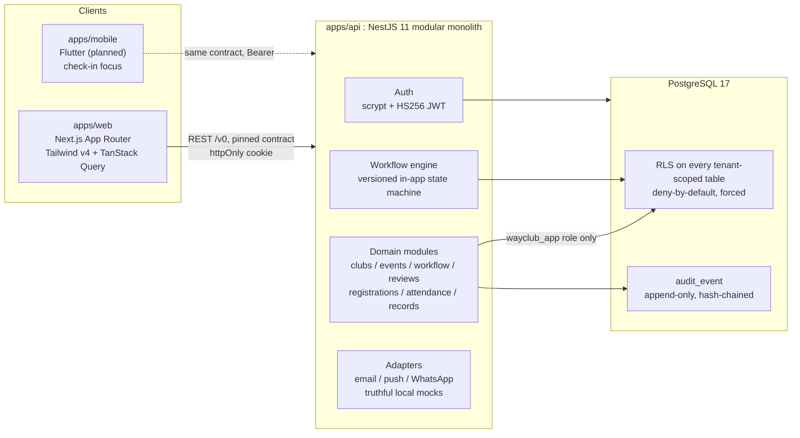
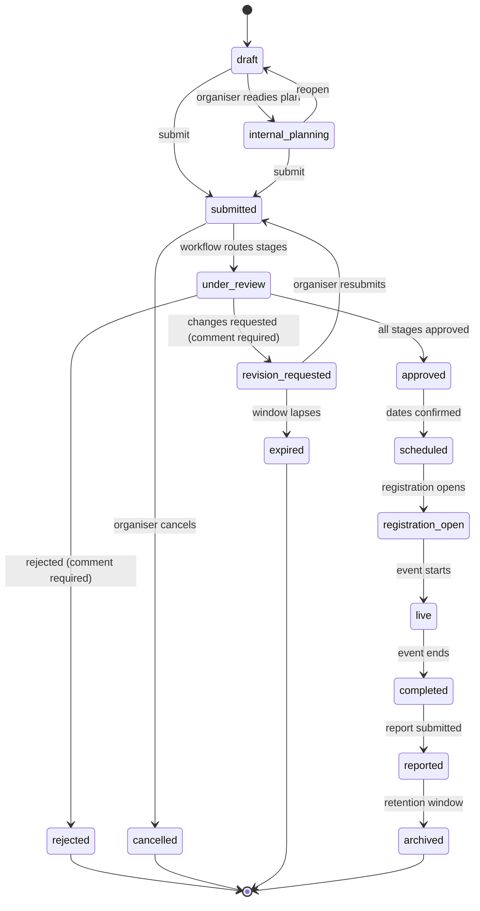
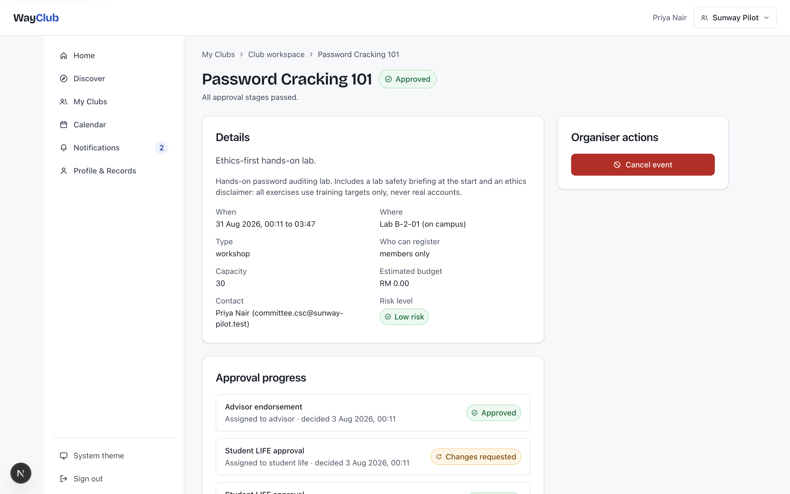
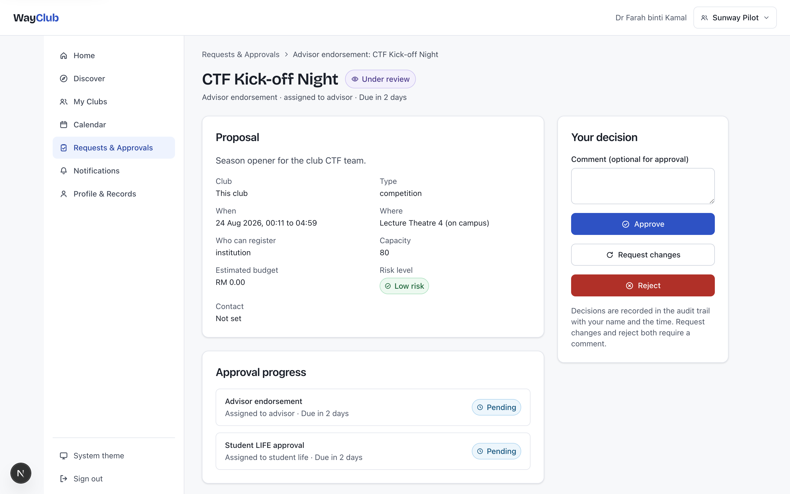
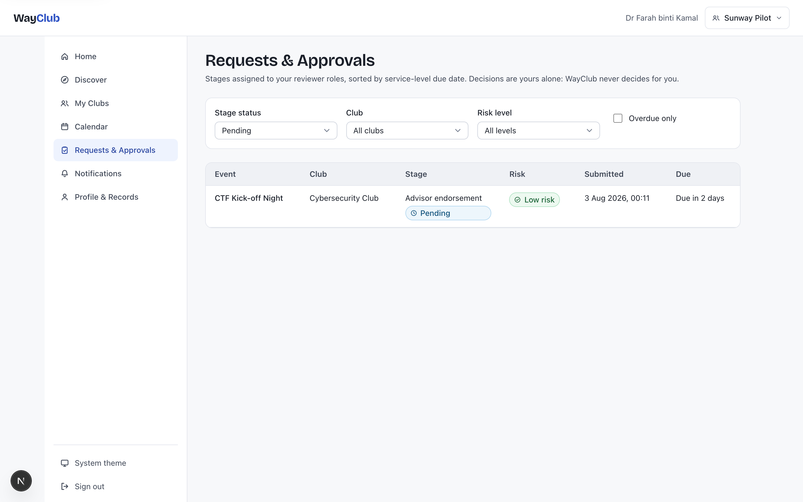
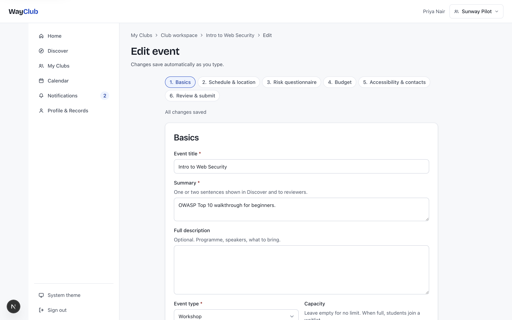
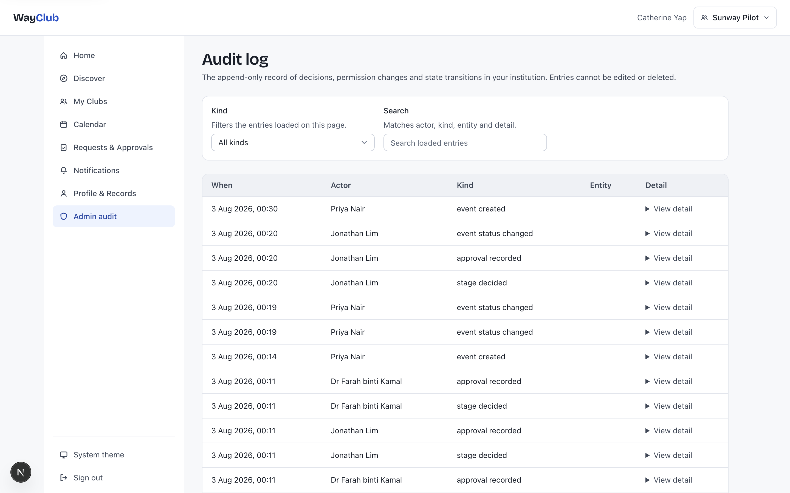
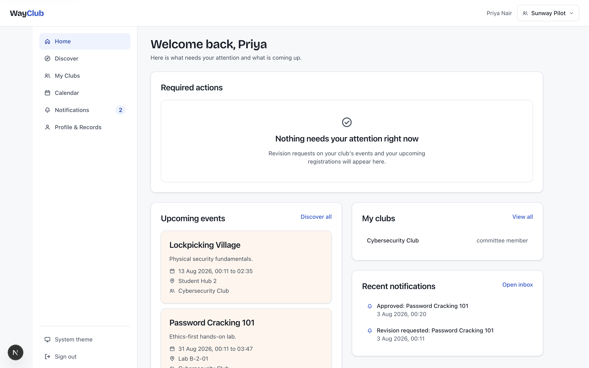

# WayClub

**WayClub is the approval and event-operations layer that lets student clubs plan, get approved, and run events in one place, while allowing universities to govern the process with confidence.**

[Live site](https://yeegz.github.io/WayClub-showcase/) · [Deep dives](#deep-dives) · [Honest status](#honest-status)

---

This is the public engineering showcase for WayClub. The full build repository is private; this repository documents the architecture, the security model, the workflow engine and the design system, with every claim traceable to real code, migrations and test suites in the private repo. The demo tenant is named "Sunway Pilot (unofficial demo)": it implies no affiliation with, or endorsement by, any institution.

## The problem

Student clubs coordinate events, approvals, members, budgets and communication across a fragmented toolchain: email, WhatsApp, spreadsheets, Google Forms, shared drives and disconnected portals. The result is slow approvals, duplicate data entry, lost documents, unclear ownership and institutional risk exposure, especially for off-campus and higher-risk events.

This is not a hypothetical. The research behind WayClub is grounded in a Malaysian private university's student council town hall (November 2024, reported in campus student media the following month), which attributed club event-approval delays to "safety concerns and administrative processes", with off-campus events requiring "additional scrutiny". The same university's clubs and societies manual requires an event proposal "at least one month before for major events and two weeks before for minor events", routed from committee to advisor to student services, with a three-working-day follow-up. Approval latency is a top committee pain, and none of the tools involved were built for it.

## The wedge: one connected event record

WayClub's core design decision is that **the event is one durable record**. The proposal, the multi-stage approval, registration, attendance, the post-event report and the student's verified involvement record all attach to the same object. Information entered once carries forward; nothing is re-keyed between modules, and nothing gets lost between an email thread and a spreadsheet.

Everything else in the architecture exists to make that one record trustworthy: who approved it and under which rules, who attended, and what a student can later prove.

## Architecture overview

A pnpm monorepo: a NestJS 11 modular monolith API, a Next.js web app, PostgreSQL 17 with row-level security, and a Flutter mobile app planned for the check-in phase. The workflow engine is a versioned, configuration-driven state machine living in application code and Postgres rows: no Temporal, no Camunda, no external authorisation service.

Key properties:

- **One API surface.** Both clients consume a pinned REST contract; the contract document changes first, in the same commit as the code. The web app holds no privileged credentials and never touches the database.
- **RLS always in force.** Every request runs as a non-owner Postgres role inside a transaction that carries the caller's JWT claims. There is no service-role path in request handling.
- **Truthful adapters.** Integrations that are not connected run as local mock providers that record payloads and say clearly that they are sandboxes. Nothing ever fakes external success.
- **Human-only decisions.** Approvals are made by people, online, always. Nothing auto-approves, and any future AI is assistive, permission-scoped and human-confirmed.

## The workflow engine

The event lifecycle is a server-owned state machine with fifteen states. Transitions are validated against the workflow definition version pinned by the instance, executed transactionally with the domain change, and every transition writes an append-only audit event.

Three approval routes ship with the seed, selected by conditions on the submitted event (`isOffCampus`, `riskLevel`, `estimatedBudgetCents` against the institution's threshold):

1. **event_low_risk**: advisor endorsement, then Student LIFE approval. The default.
2. **event_off_campus**: advisor, then Student LIFE, then safety review, in parallel with a facilities review when the venue is institution-managed.
3. **event_budget_threshold**: the otherwise-applicable route plus a finance approval stage when the estimated budget meets the institution's threshold. Conditions compose.

The engine's properties worth stealing:

- **Definitions are versioned rows.** Publishing a new version never migrates in-flight instances; every instance interprets the version it pinned at start, forever. Any historical decision can be replayed against the rules that governed it.
- **Idempotency is structural.** One decision row per stage is a database `unique` constraint, not application discipline. A revision cycle inserts new stage rows with an incremented attempt counter; nothing is ever overwritten.
- **"Current" stages are derived**, not stored: the pending stages with the lowest order. Deciding a stage requires no advancement write, so a race cannot double-advance an instance.

Full detail: [docs/02-workflow-state-machine.md](docs/02-workflow-state-machine.md).

## The security story

Cross-tenant information disclosure is the critical risk for a platform holding student data for many institutions, so tenancy is enforced where a mistake cannot reach it: in the database.

- **Deny-by-default row-level security.** RLS is enabled on every tenant-scoped table in the same migration that creates it. A table with RLS and no policy denies everything; policies grant the minimum each role needs. The request-handling role owns nothing and holds no bypass, so RLS binds it unconditionally.
- **Identity travels with the transaction.** The API verifies the session JWT, then sets the claims JSON as a transaction-local Postgres setting. Policies read `auth.uid()` and the `institution_id` claim through a Supabase-shaped shim, so pooled connections can never leak identity between requests, and a later move to hosted Supabase is a connection-string swap.
- **404 for cross-tenant.** A request for another tenant's row is indistinguishable from a request for a row that does not exist. Tenants cannot be enumerated.
- **A generic isolation test.** The test suite discovers every table carrying `institution_id` from the information schema (asserting there are more than forty, so a refactor cannot quietly shrink the list) and proves cross-tenant SELECT and UPDATE are denied on each, in both directions, with positive controls so the test cannot pass vacuously.
- **Hash-chained, append-only audit.** Every decision, transition and permission change writes an audit row carrying the SHA-256 hash of the previous row for that institution. No role holds UPDATE or DELETE on the table, and a trigger blocks both even for the table owner. Tampering breaks the chain from that point onward, and the suite verifies the chain by recomputation.

Condensed threat model (STRIDE):

| Threat | Example | Severity | Mitigation |
|---|---|---|---|
| Spoofing | Account takeover | High | scrypt password hashing, httpOnly SameSite cookies, short-lived JWTs |
| Tampering | Approval or audit-log edit | High | Append-only hash-chained audit, RLS, single-transaction transitions |
| Repudiation | "I didn't approve that" | Medium | Audit events carrying actor, timestamp and workflow definition version |
| Information disclosure | Cross-tenant leak | **Critical** | Deny-by-default RLS, per-table isolation tests, 404-for-cross-tenant |
| Elevation of privilege | President self-grants reviewer rights | High | Separation of duties, fixed role sets, scoped time-boxed grants, audited changes |
| QR fraud | Screenshot or proxy check-in | Medium | Rotating single-use HMAC tokens, 60 to 90 second expiry (design pinned for the mobile phase) |

Full detail: [docs/01-multi-tenant-rls.md](docs/01-multi-tenant-rls.md) and [docs/03-audit-integrity.md](docs/03-audit-integrity.md).

### What an adversarial review found

Design claims are worth little until someone tries to break them, so the build was put through a three-lens adversarial review (tenancy and RLS, API and workflow, web and accessibility) whose brief was to refute the claims above rather than confirm them. It proved 18 defects with reproducible output. That result is reported here because a security section that only lists intentions is the least trustworthy kind.

**What held.** Cross-tenant SELECT, UPDATE, DELETE and INSERT sweeps across all 25 tenant-scoped tables leaked nothing, in both directions, including from the lowest-privilege student role. Sessions carrying no claims read zero rows everywhere, confirming deny-by-default. Over HTTP, every cross-tenant object returned 404 rather than 403, so the no-enumeration discipline is real. JWT `alg:none` and wrong-secret tokens were rejected. Four sign-up domain-bypass attempts failed. Decision replay and conflict semantics matched the specification exactly, and double approvals are blocked structurally by a unique constraint rather than by application logic. Attendance codes proved unbiased.

**What did not.** The worst finding was in the workflow engine, not the tenancy layer: approval routing was never re-evaluated after a revision cycle, so an organiser could take an event approved on the low-risk route, edit it during revision into an off-campus, high-risk, over-threshold event, resubmit, and keep the original two-stage route. Safety, facilities and finance never saw it. The reviewer's control case made it unarguable: the same content submitted fresh produced five approval stages, and smuggled through a revision produced two. That is fixed, along with risk-level routing, a budget threshold that failed open when an institution had not configured it, and two dead ends that made the core flow unusable from the interface.

Several findings remain open at the time of writing, including audit-chain ordering under concurrent writes and session revocation. They are tracked with severity, location and status in the build repository's status document rather than quietly deferred. The honest summary is that the tenancy boundary survived sustained attack and the workflow layer did not, which is roughly the opposite of what the design documents predicted.

## Design and accessibility

WCAG 2.2 AA is a release requirement, not a polish pass. The token system ships light and dark themes, and every colour pair it exposes is verified programmatically at build time: 54 pairs, 108 checks across both modes, with the build failing on any violation. Every text pair currently sits at or above 4.97:1; the worst checked pair is 3.79:1 on a border that needs 3:1. Institution branding is constrained by construction: a tenant can change a logo and two brand colours, and the derived values are adjusted until they meet contrast, so a tenant cannot break readability.

Full detail: [docs/04-accessibility-and-design.md](docs/04-accessibility-and-design.md).

## Honest status

This section follows a strict rule: claim only what exists at each maturity tier, and never borrow wording from a tier above.

**Built** (technical scope, verified by test suites in the private repository):

- A multi-tenant Postgres 17 foundation: 58 domain tables across 8 migrations, RLS enabled on every tenant-scoped table, deny-by-default policies for the pilot slice, and a 29-test suite covering cross-tenant isolation on every tenant-scoped table, permission enforcement, approval integrity, audit immutability with hash-chain verification by recomputation, and optimistic concurrency.
- A versioned in-application workflow engine: immutable definition versions, instances that pin their version forever, structurally idempotent approvals, append-only revision attempts, and a single guarded transition path with typed error codes.
- An append-only, per-tenant hash-chained audit log written by database triggers, so key state changes cannot skip it.
- A cross-platform design token system with an automated WCAG contrast gate (108 checks per build) and constrained tenant branding.
- The web vertical slice of the pilot flow: propose, submit, review and decide, register, check in by accessible code entry, and read the resulting involvement record.

**Designed** (specified and binding, not yet implemented; no usage or performance claims permitted):

- The Flutter mobile app and the rotating HMAC QR check-in with offline reconciliation (threat model pinned now so the implementation cannot drift).
- SSO (SAML/OIDC), budget and reimbursement, verifiable credentials (Open Badges 3.0), institution-level workflow configuration beyond the seeded routes, and retention tooling.

**Not claimed**: usage, adoption, approval-time reduction, performance under load, institutional endorsement. No pilot has run yet.

> **What I would claim in an interview:** "I built a multi-tenant event-approval platform on Postgres row-level security, with a versioned in-application approval workflow engine, structurally idempotent decisions and a tamper-evident hash-chained audit log, and an accessible web slice that runs the event lifecycle end to end. That is a technical-scope claim: no pilot has run, so I make no usage or outcome claims."

## Screens

Captured from the running application against seeded demo data. Nothing here is a mock-up.

| | |
|---|---|
|  |  |
| **The one record.** Proposal, approval progress and decision history live on the event itself, so nothing is re-keyed between stages. | **Reviewer decision.** Full context on one page. Request changes and reject both require a written comment. |
|  |  |
| **Approvals queue.** Only the stages assigned to your reviewer roles, sorted by service-level due date. | **Proposal form.** Six steps, autosave with an honest saved-at indicator, review before submit. |
|  |  |
| **Audit log.** Append-only and hash-chained in the database: entries cannot be edited or deleted, by anyone. | **Home.** Required actions first, and empty states that say why they are empty. |

Every screen is captured in both light and dark; all twenty images are in [`site/assets/screens/`](site/assets/screens), including discover, club workspace, organiser check-in and profile records.

## Deep dives

Each document stands alone and cites the private repository's files by path.

| Document | What it covers |
|---|---|
| [01-multi-tenant-rls.md](docs/01-multi-tenant-rls.md) | The Supabase-shaped shim, the three database roles, deny-by-default policy patterns, the denormalised `club_id` decision, and the generic cross-tenant denial test |
| [02-workflow-state-machine.md](docs/02-workflow-state-machine.md) | Versioned definitions, pinned instances, structural idempotency, append-only attempts, derived current stages |
| [03-audit-integrity.md](docs/03-audit-integrity.md) | Hash chaining, trigger-enforced append-only, and what tampering looks like |
| [04-accessibility-and-design.md](docs/04-accessibility-and-design.md) | The WCAG 2.2 AA approach, the token system, and the automated contrast gate |
| [05-product-boundaries.md](docs/05-product-boundaries.md) | Rejected scope and why: no surveillance, no leaderboards, no chat, privacy-by-design under the PDPA |

## About this repository

- `site/` is a self-contained landing page, deployed to GitHub Pages by `.github/workflows/pages.yml`. No analytics, no trackers, no external requests.
- `site/assets/screens/` holds the application screenshots, in light and dark. They live under `site/` because that directory is what gets deployed.
- `assets/` holds self-made SVGs used by this README.
- The build repository (application code, migrations, tests, seeds) is private. This showcase quotes its structure and numbers accurately but contains no application code.
- Licence: [MIT](LICENSE). Copy anything you find useful.

Built by [Yousof Selim](https://yeegz.github.io). British English throughout, by design.
