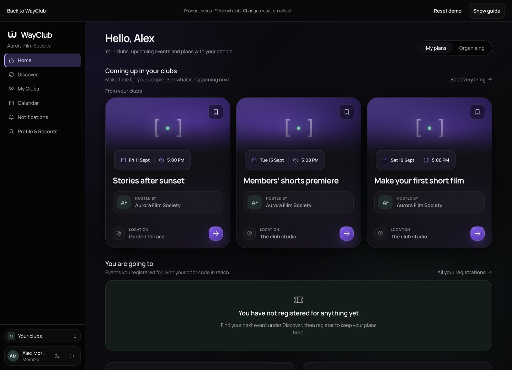
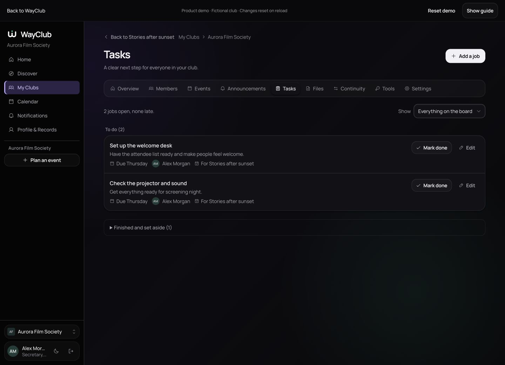

# WayClub

**Your club. All together.**

One home for your people, events and the work that keeps a club going.

[Explore WayClub](https://wayclub-live-demo.web.app) · [Take the guided tour](https://wayclub-live-demo.web.app/home?tour=1) · [Engineering notes](#engineering-notes)

WayClub helps independent and university clubs bring members together, organise events, share responsibilities and pass useful records to the next committee. An event stays one record from its first draft through review, registration, attendance and close-out.

This repository is the public product and engineering showcase. Application source, migrations, tests and deployment configuration are maintained in a separate private repository.

## Try the product interface

The [public Firebase demo](https://wayclub-live-demo.web.app) opens with a product landing page and lets visitors explore the **actual WayClub frontend components**, backed by isolated, fictional sample data. There is no account to create and no shared customer database behind this demo.

- Explore the home screen, club workspace, members and events.
- Save an event, register for it and see the sample attendance code.
- Browse the calendar and personal registration view.
- Add a job, assign it to a teammate and mark work complete.
- Turn the guide on or off, navigate freely and reset the sample workspace.

Sample changes reset on reload. This preview covers selected workflows; it does not send email, accept real uploads or create real accounts. Other modules are identified as outside the demo when opened.

## What WayClub brings together

| For | A clearer way to work |
| --- | --- |
| Members | Find clubs and events, join, register, keep track of plans and attendance records. |
| Organisers | Create a workspace, invite the team, plan events, assign tasks and keep files and announcements together. |
| Reviewers | Follow the approval route, see what changed, request revisions and record decisions. |
| Incoming committees | Receive responsibilities, equipment and records with an explicit handover. |

The product supports independent clubs as well as institution-connected workspaces. University approval remains a human decision where that review process applies.

## The WayClub identity

A rounded W mark, Manrope typography, soft dark surfaces and restrained violet and mint accents connect the public page to the working screens. Shared event cards, buttons, dialogs, navigation and status treatments keep the product consistent. Club artwork adds character without replacing the platform’s navigation or hierarchy.

The September refinement softened generated artwork and image fades, simplified crowded actions, centred dialogs, improved phone layouts and preserved reduced-motion and keyboard behaviour.

## Engineering

- **Next.js 15 and React 19** for the web, with shared design tokens and TanStack Query.
- **NestJS 11** as a modular API and **PostgreSQL 17** with tenant-bound row-level security.
- Versioned event workflows, explicit permissions, concurrency checks and append-only audit records.
- Self-service account and club creation, invitations, public joining and password recovery implemented in the application.
- A Firebase/Google deployment package for Hosting, Cloud Run, Cloud SQL, private object storage and background maintenance.
- A separate static Firebase demo build that substitutes sample data at build time. Production request handling is not replaced by the demo adapter.

## Current release status

**Updated 8 September 2026.** The public demo is live on Firebase Hosting. The full application is **not yet deployed on the replacement backend**. Paid infrastructure, an owned email sender domain, live account and file journeys, backup restoration and operational checks remain launch work.

The earlier Vercel/Fly deployment is historical and is not the current public product entry point. No adoption, institution endorsement, load-test result or production-readiness claim is made here.

Latest recorded checks:

| Check | Evidence |
| --- | --- |
| Web tests, 8 September | 714 passed across 85 files. |
| API integration, 6 September | 714 passed across 52 files. |
| Isolated database checks, 6 September | 104 passed across two files. |
| Builds | Production Next.js and isolated demo builds passed. |
| Browser verification | Real-screen demo navigation, registration and task interactions checked; desktop and phone layouts inspected. |

These are dated development checks, not proof of a complete production deployment.

## Engineering notes

The deeper notes below document earlier architecture work. Their opening notices identify the historical snapshot; dated catalogue counts and old hosting references are not current release measurements.

- [Tenant isolation and row-level security](docs/01-multi-tenant-rls.md)
- [Versioned workflow state machine](docs/02-workflow-state-machine.md)
- [Audit integrity](docs/03-audit-integrity.md)
- [Accessibility and design](docs/04-accessibility-and-design.md)
- [Product boundaries](docs/05-product-boundaries.md)
- [Colour from content](docs/06-colour-from-content.md)

## Repository contents

`site/` contains the GitHub Pages showcase. `assets/` contains brand assets and product captures using fictional sample data. September images show the current demo; August captures are retained as historical material.

No credentials, real member records or private application source are published here.

Built by [Yousof Selim](https://yousofselim.com). Showcase material is available under the [MIT licence](LICENSE).

## About the developer

Built by [Yousof Selim](https://yousofselim.com). Explore the [guided demo](https://wayclub-live-demo.web.app/home?tour=1) or [get in touch](mailto:yousofselim2@gmail.com) about product engineering work.
