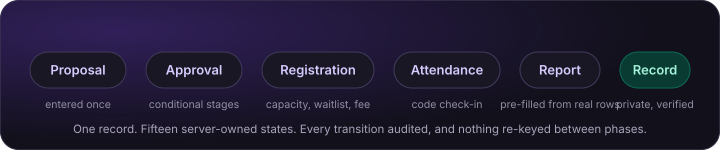

# WayClub

**A lit, governed home for everything a student club runs.**

[What it does](#what-a-real-person-can-finish-today) · [The identity](#the-identity) · [The engineering](#the-engineering-worth-your-time) · [Honest status](#honest-status) · [Deep dives](#deep-dives)

---

WayClub is the approval and event-operations layer that lets student clubs plan, get approved and run events in one place, while allowing universities to govern the process with confidence.

This is its public engineering showcase. The build repository is private; this one documents what the product is, what it can actually do, and how it is built, with every number read from that code, its database catalogue or a test run rather than carried forward from an earlier draft of this file. The demo tenant is named "Sunway Pilot (unofficial demo)": it implies no affiliation with, or endorsement by, any institution, and every person in the seeded database is fictional.

**It is now deployed.** The current production web origin is <https://web-black-ten-svvh000cju.vercel.app> and the API serves from <https://wayclub-api.fly.dev>. Read [Honest status](#honest-status) before anything else here impresses you, because "deployed" is not the same claim as "production-proven".

## The problem

Student clubs coordinate events, approvals, members and communication across email, WhatsApp, spreadsheets, forms, shared drives and disconnected portals. Approvals are slow, documents go missing, ownership is unclear, and nobody can say afterwards who agreed to what. Off-campus and higher-risk events are the worst of it, because they are exactly the ones that need a paper trail.

This is not hypothetical. The research behind WayClub is grounded in a Malaysian private university's student council town hall of November 2024, reported in campus student media the following month, which attributed club event-approval delays to "safety concerns and administrative processes", with off-campus events requiring "additional scrutiny". The same university's clubs and societies manual requires an event proposal "at least one month before for major events and two weeks before for minor events", routed from committee to advisor to student services with a three-working-day follow-up. Approval latency is the top committee pain, and none of the tools involved were built for it.

## The wedge: one durable event record

WayClub's core design decision is that **the event is one durable record**. The proposal, the multi-stage approval, the poster, registration, the entry fee, attendance, the photographs taken on the day, the post-event report and the student's verified involvement record all attach to the same object, through fifteen server-owned states from `draft` to `archived`. Information entered once carries forward; nothing is re-keyed between modules, and nothing is lost between an email thread and a spreadsheet.

Everything else in the architecture exists to make that one record trustworthy: who approved it and under which rules, who attended, and what a student can later prove.

## What a real person can finish today

This section exists because test counts were once mistaken for product progress. Every line below is a journey somebody can complete end to end in the running application. Where something stops short, it says so.

**A founder** lands on a public homepage, creates an account with any email address, creates an independent club workspace, and starts running the club immediately without an institution-managed login. They can invite people into club roles by email, and those invitees can either attach the membership to an existing account or create a new account while claiming the invite. One person can belong to more than one club or workspace and switch between them.

**A student** signs in, browses clubs with each club's trust state in plain language, joins an open club immediately or applies to an approval-based one and answers that club's own questions, and sees their own application status and nobody else's. They discover events under day headers with posters, entry-fee chips and going counts; save an event they are interested in without committing to attend, and see that state persist on every card everywhere; register, with capacity and a waitlist; check in with an eight-character attendance code; upload a photograph to the event's gallery once it is live; and hold a verified involvement record they can download as a document. Leaving a club is refused while they hold committee office, with a sentence saying why.

**A committee member** writes a multi-step proposal that autosaves, uploads a poster with required alt text, and submits it into an approval route chosen by the answers given. When changes are requested they revise, and the route is re-evaluated against what the event now is rather than what it was. They walk the event through approved, scheduled, registration open, live, completed, reported and archived; run check-in; write a post-event report pre-filled from the event and from real attendance rows; issue participation records and certificates to verified attendees; curate the event's photo gallery; post announcements and upload files; set club jobs with due dates and assignees; and shape the club's own look in a customisation studio with a live preview, a contrast readout and version history.

**A reviewer** works a queue sorted by service-level due date, filtered by status, club, risk and overdue. They open full event context on one screen with a field-level diff of what changed since the last submission, rendered as sentences ("Budget: RM 500.00 to RM 2,400.00"), with a warning in words when the risk level moved, because that changes who must approve. They approve, request changes with a mandatory comment, or reject. Going away, they delegate the queue to a named substitute for a bounded period; the substitute's decisions read "as substitute for…", and a substitute cannot decide an event they submitted themselves, refused both in the service and again by a database trigger.

**An outgoing president** records an election or an appointment as an outcome with mandatory evidence, forms the incoming term, initiates a handover with role-specific checklists, resolves ownership risks, completes a two-party external-access attestation that the incoming custodian can sign even though they hold no authority yet, obtains advisor verification, and executes an effective-date authority transfer, all in the browser. Trying to transfer early is refused with both instants in the message. No secret is ever collected, and that is a schema-level guarantee rather than a policy: no continuity table has a credential-shaped column, asserted against the information schema, and credential-shaped free text is a 400 before any service runs.

**A department director** opens oversight, which answers "what can I oversee" from the server rather than guessing, and reads what is blocked, who is waiting on whom and what is overdue for the committees they answer for. When the answer is nothing it says so plainly, rather than rendering an empty institutional frame: *"You do not oversee any committees. Oversight is for department directors, club presidents and Student LIFE. Ask your university administrator if you should have it."*

**A club with no university can do all of this too.** Aurora Film Society is a standalone account. Its events route through an internal review, a committee check decided by the president followed by a courtesy advisor endorsement, and that check can genuinely say no. Its approvals are recorded as `CLUB_INTERNAL` and `ADVISOR_REVIEW`, never `INSTITUTION_OFFICIAL`, because an official approval is structurally impossible without an institution. A university permission letter obtained outside WayClub is filed as external evidence, in a different table, and is never rendered as a WayClub approval.

**WayClub never processes a payment.** An event can carry an entry fee, and the fee tile says so verbatim: **"Collected by {club}, not by WayClub."** No money moves through the product, deliberately.

## The identity

The first design pass measured a strong reference product honestly and produced something competent and anonymous. The owner rejected it, redesigned the event card himself, and supplied a runnable mockup drawn over a real WayClub screenshot plus a written brief. That mockup is now the design authority: where it and any prose description disagree, including this one, the mockup wins.

### A violet-black world with something lit in it

| Role | Value |
|---|---|
| Page | `#090811` |
| Card surface | `#12101B` |
| Raised surface | `#1A1725` |
| Primary violet | `#8B5CF6` |
| Emerald accent | `#5EE7C4` |
| Primary ink | `#F8F6FF` |

None of those is a pasted literal. The token package holds recipes in OKLCH: a lightness ladder, a chroma curve, a hue and an optional hue shift per family. The build materialises every step, gamut-maps it into sRGB by lowering chroma at fixed lightness and hue, and writes the resolved values out. The ladder is anchored so the generator lands on the owner's own hexes, and seven of the nine land exactly.

Two did not survive the contrast gate, and moved one rung up their ramp. The muted label he drew measured 4.07:1 on his own card surface and 3.81:1 on the raised row, so it moved. The top stop of the action gradient measured 2.40:1 against a white arrow, so it moved too, and the bottom stop followed. That is the rule working: **if a value fails, the value moves, never the gate.**

The page itself is not a flat sheet. A violet radial falls from the upper left and an emerald one from the lower right, over a three-stop base gradient, with a 42px grid at 1.8% ink masked away at the top and bottom. Light mode is the same world in daylight rather than an inversion.

### One card, and blur that is rationed

Every event in the feeds is drawn by one shared card component: hero artwork, a blurred save control, a glass schedule pill overlapping the hero's lower edge, the title with a lit dot that never travels without the words beside it, an inset "Hosted by" row carrying the club's real logo, and the gradient arrow that opens it. The calendar uses a dense row variant that reuses the same art, pill and chips. It lifts 7px on hover behind `(hover: hover)`, and holds still entirely under `prefers-reduced-motion`, removed outright rather than merely shortened, because a collapsed transition duration still lets a transform land.

With no poster the hero must still look designed, from CSS alone and with no new asset: a deep indigo to ultraviolet radial, a faint perspective grid, a beam, an orb and the waypoint emblem, with the hue taken from the club's own accent so a red club gets red-family art even in a shared feed.

Blur is a tool for things floating over imagery, not a style. In the whole web application there are exactly four backdrop-filter declarations, in one `@supports` block, defining two classes, each used at exactly one site: the schedule pill and the save control. Everything else is opaque, and both glass fills are contrast-checked over white artwork and over black.

### Colour that comes from the content

A club publishes an accent and an OKLCH engine derives its whole room: canvas, inks, hairlines and action colour, every one contrast-gated. Inside a club's own space that palette takes over. On a mixed surface, home, discover and the calendar, the page stays WayClub's and the variety comes from the artwork, because a feed repainted per row is a rainbow. A club sets two hues and nothing else; the strengths are platform-owned, so no club can hand its page a brighter glow than the page next door.

Separately, every uploaded image is measured for the colour it is actually about, and an event page is lit by its own poster. Measured live on the running product, two events of the **same** club:

| Event | Stored poster colour | Derived light, dark mode |
|---|---|---|
| Open Day: Capture the Flag Taster | `#6A4AA9` | `rgb(98, 50, 172)` |
| Blue Team Bootcamp | `#35857F` | `rgb(20, 98, 93)` |

The measurement is a chroma-weighted hue histogram rather than a most-frequent colour, so a small saturated logo can beat the white field it sits on, and an image with no colour worth reporting stores nothing at all rather than a confident guess. The club's accent and the poster's light are deliberately separate: an action colour is an identity, and an identity that changed hue whenever somebody uploaded a picture would not be one.

Reviews, oversight and administration are **excluded from the atmosphere structurally**, not by convention. A club room mounted anywhere inside one of those surfaces cannot tint it, and a test named "Calm Operations never tints, structurally" pins that so the rule cannot decay into a habit. A dean processing twelve approvals gets a neutral, dense, fast screen.

### The mark is a waypoint

The previous mark was a bold W whose right arm finished higher than its left. It was competent and it was anonymous: drawing the letter the name starts with is what a product does when it has not found an idea. The mark is now two brackets framing a single lit point, a place marked, a point on a way. The brackets are always WayClub's; the point can carry a club's own hue. The same glyph serves the navigation, the browser tab and the app icon, so there are not three drawings to drift apart.

Full detail: [docs/06-colour-from-content.md](docs/06-colour-from-content.md) and [docs/04-accessibility-and-design.md](docs/04-accessibility-and-design.md).

## The engineering worth your time

### Tenancy is enforced where a forgotten check cannot reach it

Cross-tenant information disclosure is the critical risk in the threat model, so the boundary lives in the database. **The tenant root is the account, not the institution**, because a club must be able to adopt WayClub without its university being a customer. Two columns sit on every tenant-scoped table and they are not redundant: `account_id` is who owns the data and is never null, and `institution_id` is who governs it and is null for a standalone club.

- **Deny by default, in two layers.** Row-level security is enabled on every tenant-scoped table in the migration that creates it. Freshly re-read from the catalogue on 2026-08-05, the current build carries 177 policies across 64 tables. The tenant boundary remains account-rooted and is asserted mechanically against `pg_policy` rather than against a hand-kept list. Twenty-six tables still have RLS on, no policies and no grants, so an unbuilt surface fails at the grant layer first and the policy layer second.
- **Identity travels with the transaction.** Each request runs as a Postgres role that owns nothing and holds no bypass attribute, inside one transaction that first sets the caller's verified claims as a transaction-local setting. Policies read them through a shim shaped exactly like hosted Supabase, so pooled connections cannot leak identity between requests and a later move to hosted Postgres is a connection-string swap rather than a policy rewrite.
- **A club cannot impersonate an institution, structurally.** Every tenant-scoped row carries a composite foreign key binding its `institution_id` to its own account. That is a constraint, not a policy, so it binds the table owner and the bypass role exactly as it binds the request role. A standalone account owns no institution row, so it cannot write an institution reference anywhere at all, cannot hold an official reviewer role, and cannot record an approval carrying a university's authority. Verified: even the owning role gets SQLSTATE `23503`.
- **404, indistinguishable from not-found.** A request for another tenant's row returns 404, byte-identical to a request for a row that never existed. The test that proves it sits directly beside the test proving a same-tenant outsider gets 403 with a permission-denied code, which is what makes the distinction real rather than incidental.
- **Row-level security is deliberately not forced, on evidence.** Forcing it made a membership helper return false for a genuine member, because the policies' own `SECURITY DEFINER` helpers run as the owner: forcing RLS breaks the mechanism it is meant to strengthen. The real boundary is that the request role owns nothing and holds no bypass, and catalogue-reading tests assert the actual posture so documentation cannot drift from it again.

Full detail: [docs/01-multi-tenant-rls.md](docs/01-multi-tenant-rls.md).

### A workflow engine made of rows

The approval engine is a versioned, configuration-driven state machine living in application code and Postgres rows. No Temporal, no Camunda, no external authorisation service: human approval workflows measured in days need explicit states, conditional routing, deadlines, idempotent transitions, an audit trail and version pinning, and all of those live naturally in rows.

- **Definitions are versioned rows, and instances pin their version forever.** Publishing a new version never migrates in-flight instances. Any historical decision can be replayed against the rules that governed it.
- **Idempotency is structural.** One decision per stage is a unique constraint. A decided stage matches no update policy and cannot be touched again, including by the reviewer who decided it. A rejection without a comment is a constraint violation, not a UX oversight.
- **Revision cycles append.** Resubmission inserts new stage rows with an incremented attempt counter; nothing is overwritten, and the reviewer sees every attempt.
- **The current stage is derived, never stored.** There is no pointer to race over.
- **Routing is re-evaluated on every resubmission**, and this one was learned the hard way. See below.

Full detail: [docs/02-workflow-state-machine.md](docs/02-workflow-state-machine.md).

### An audit log that forked under load, until it did not

Every decision, transition and permission change writes a row committing to the hash of the previous row for the same account. No role holds update or delete on the table, and a trigger blocks both even for the owner, so rewriting history requires DDL rather than a quiet data edit.

The interesting part is that the first design was wrong in a way a serial test suite could never show. Chain position was an identity column, allocated while forming the tuple, **before** the trigger took its advisory lock, so allocation order and lock order could differ and a row could chain onto a row that came after it. Reproduced, fixed by allocating position inside the lock at commit time, backstopped by a unique constraint, and now covered by a test that genuinely overlaps two transactions. The same fix cut the lock's critical section from the whole request to the commit: same-tenant audited writes went from about 4.8 seconds to about 50 milliseconds in the same experiment.

Full detail: [docs/03-audit-integrity.md](docs/03-audit-integrity.md).

### What an adversarial review found

Design claims are worth little until somebody tries to break them, so the build was put through a three-lens adversarial review whose brief was to refute the claims above rather than confirm them. It proved **18 defects** with reproducible output.

**What held.** Cross-tenant sweeps across every tenant-scoped table leaked nothing in either direction, including from the lowest-privilege student role. Sessions carrying no claims read zero rows everywhere. Every cross-tenant object returned 404 rather than 403 over HTTP. Tokens with no algorithm or the wrong secret were rejected. Sign-up domain bypasses failed. Double approvals were blocked structurally by a unique constraint rather than by application logic. Attendance codes proved unbiased.

**What did not.** The worst finding was in the workflow engine, not the tenancy layer: approval routing was never re-evaluated after a revision cycle, so an organiser could take an event approved on the low-risk route, edit it during revision into an off-campus, high-risk, over-threshold event, resubmit, and keep the original two-stage route. Safety, facilities and finance never saw it. The reviewer's control case made it unarguable: the same content submitted fresh produced five approval stages, and smuggled through a revision produced two.

All eighteen are now closed, each re-verified by replaying the reviewer's own exploit rather than by trusting a fix report. Two more were found during that verification, and they are the two the review missed: session revocation had a one-second blind spot that an existing test had been hiding behind a sleep, and the two-party attestation was unwritable by the very person it required, because the policy gated on committee rights the incoming officer deliberately does not hold yet. The honest summary is that the tenancy boundary survived sustained attack and the workflow layer did not, which is roughly the opposite of what the design documents predicted.

### Production shape

Not a deployment, but the shape of one, each piece proven by a test rather than asserted:

- All bytes flow through a storage facade. The S3-compatible driver is proven against an in-process fake HTTP server that **recomputes AWS SigV4 signatures** rather than checking their shape, verifies presigned URLs separately, and checks the payload hash against the bytes that actually arrived. Production refuses to boot on the local driver.
- A real SMTP driver, proven by a message crossing a live socket and asserted on the decoded bytes, with a second test that completes a whole sign-up using only what the driver sent. Production refuses the sandbox.
- A health endpoint that runs `select 1` through the same pool that serves requests, with a timeout and single-flight so a wedged database does not accumulate abandoned queries, returning 503 while shutting down so deploys drain.
- Single-instance enforcement by a Postgres advisory lock taken before the application is created, with bounded retry to cover rolling-deploy overlap.
- Structured JSON logs with per-request correlation and secret redaction. Six patterns, applied in order, JWT-shaped strings first so a link keeps losing its token even under an unexpected parameter name. Email addresses are masked rather than removed, which keeps a log line legible without keeping the address.
- Money is integer minor units with an ISO 4217 code, exponent-aware and with **no fallback currency at all**: an amount with no code renders as a plain number rather than being silently branded in somebody else's money. JPY has no minor units and KWD has three, so "divide by 100" was wrong rather than merely parochial. A GBP, Europe/London standalone account is seeded specifically so a Malaysian default cannot hide in code and pass tests.

## Honest status

One rule: claim only what exists at each tier, and never borrow wording from the tier above.

**Built and usable by a real person on the web.** The core loop end to end. Account tenancy with deny-by-default row-level security. The versioned workflow engine with re-evaluated routing. The append-only per-account hash-chained audit log. Leadership continuity at the database, API and web layers. Standalone club mode, including a standalone club actually getting an event approved. A public landing page, open sign-up with any email, founder-first club creation, multi-workspace switching, and club-role invites by email with claim flows for both existing and new accounts. Per-club theming, poster-derived light and the token contrast gate. Committee tasks, announcements, files, the event gallery, oversight reads, reviewer delegation. The product is deployed: Vercel for web, Fly.io for the API and hosted Supabase for the database.

**Partly built, with the gap named.** Saving an event works on every card and the flag rides every listing, but no screen lists what a person saved: the endpoint and the hook exist and nothing renders them. Reviewer queue filters and sort do not survive navigating into a stage and back, which the research names as the most-cited reviewer frustration. An institution claim and club migration can be negotiated but not executed: the transactional data move is unwritten. Notifications reach an in-app inbox and real email, with no per-person channel preferences, no digests and no push.

**Not built.** The mobile app: its directory is a README, deliberately, and its scope is the full product on a phone rather than a check-in companion. QR check-in and the offline attendee queue, which belong to that app; the token design is pinned so the implementation cannot drift, and the substrate table is deliberately unreachable until then. Twenty-six tables are shape rather than delivery: budgets and reimbursements, meetings and minutes, projects, venue and asset booking, club formation and registration, general requests, notification preferences, event templates, calendar items, imports, retention and verified student identity. Interface translation, although money and time are already international.

**Never done at all.** No production backup has ever been restored into a scratch environment. Nothing has been load tested, so the performance targets in the architecture document are budgets rather than measurements. There is no axe dependency anywhere in the repository, so there is no automated accessibility scan, and no screen-reader pass has been recorded.

**Deployed does not mean production-proven.** The hosted stack is live, but two operational proofs are still missing and matter more than a vanity launch: one real backup restore, and one end-to-end hosted file upload and download through the production bucket. The current sender is also still a test sender (`WayClub <onboarding@resend.dev>`) until a verified domain is configured.

**Not claimed at all**: usage, adoption, reduction in approval time, performance under load, institutional endorsement. No pilot has run.

### The numbers, and how they were taken

Catalogue counts re-read on 2026-08-05 against the current local seeded build. Test results below were also re-run on 2026-08-05 and are intentionally reported as they landed, not rounded up into "basically green".

| Fact | Value | How |
|---|---|---|
| Migrations applied | 40 | `schema_migrations`, and the migration directory, agree |
| Tables in `public` | 93 | `pg_class` where `relkind='r'` |
| RLS enabled | 90 of 93 | the rest are the global role catalogue, the migration ledger and one new account-scoped table still missing RLS |
| Policies | 177 across 64 tables | `pg_policy` joined to `pg_class` |
| Tables with RLS, no policies and no grants | 26 | the honest breadth gap |
| Database suite | 100 passed, 4 failed | `vitest run --dir infra/postgres/tests` |
| API integration suite, against real Postgres | 639 passed, 4 failed, 39 files | `pnpm --filter @wayclub/api test` |
| Web unit and component suite | 651 passed, 2 failed, 74 files | `pnpm --filter @wayclub/web test` |
| Design-token contrast gate | 562 checks, plus 380 club-theme and 280 club-ambience | `node build.mjs --check` |
| Browser journeys | 11 declared across 6 spec files | not re-run for this document |

**Fresh verification is not fully green.** On 2026-08-05 the database suite failed 4 tests, the API suite failed 4 tests, and the web suite failed 2 tests. The concrete failures reached during that pass were: missing RLS on `club_invite`; auth-schema guard regressions in the database suite; standalone onboarding conflicts and one unexpected 404 in the API suite; and two web regressions in `ambience.test.tsx` and `design-system-rules.test.ts`. That is the status to believe until a newer run replaces it.

## Deep dives

Each document stands alone and cites the private repository by path.

| Document | What it covers |
|---|---|
| [01-multi-tenant-rls.md](docs/01-multi-tenant-rls.md) | The account as the tenant root, the Supabase-shaped shim, three database roles, deny-by-default policy shapes, the composite foreign key that binds even the owner, why RLS is deliberately not forced, and the catalogue-reading tests |
| [02-workflow-state-machine.md](docs/02-workflow-state-machine.md) | Versioned definitions, pinned instances, structural idempotency, append-only attempts, derived current stages, and re-routing on resubmission |
| [03-audit-integrity.md](docs/03-audit-integrity.md) | Per-account hash chaining, four layers against mutation, the concurrency defect that was real, and the honest boundary of tamper-evidence |
| [04-accessibility-and-design.md](docs/04-accessibility-and-design.md) | The token system, the contrast gate that cannot be signed off around, constrained club branding, and the structural requirements |
| [05-product-boundaries.md](docs/05-product-boundaries.md) | Rejected scope and why: no surveillance, no leaderboards, no chat, privacy by design |
| [06-colour-from-content.md](docs/06-colour-from-content.md) | How a club accent becomes a room in OKLCH, how an image reports the colour it is about, and how a page is lit by its own poster without costing a reader their contrast ratio |

## About this repository

- `site/` is a self-contained landing page. No analytics, no trackers, no external requests of any kind: no external stylesheet, script, font or image. It carries the same violet-black world as the product, works from 320px, is keyboard-complete with a visible focus ring on every stop, and holds still under `prefers-reduced-motion`. It is the showcase site for this repository, distinct from the live product deployment above.
- `assets/` holds the self-made SVGs used by this README and the landing page, and the application screenshots when they exist. The deploy workflow copies it into the published site so one checked-in copy serves both.
- Current captures were refreshed on 2026-08-05 against the current local seeded build: the public landing page on desktop and phone width, the signed-in club workspace, the reviewer queue, and the phone-width discover feed with the current event cards.
- The build repository (application code, migrations, tests, seeds) is private. This showcase quotes its structure and numbers accurately and contains no application code, no credentials and no real personal data.
- Licence: [MIT](LICENSE). Copy anything you find useful.

Built by [Yousof Selim](https://yeegz.github.io). British English throughout, by design.
